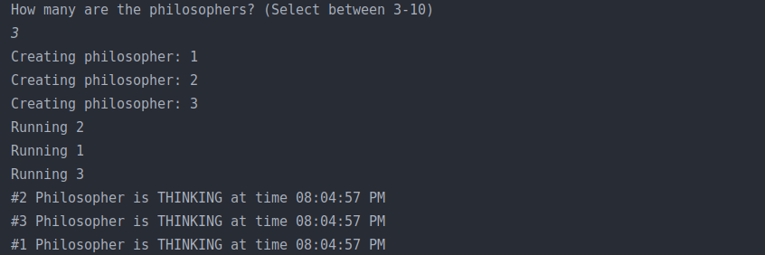
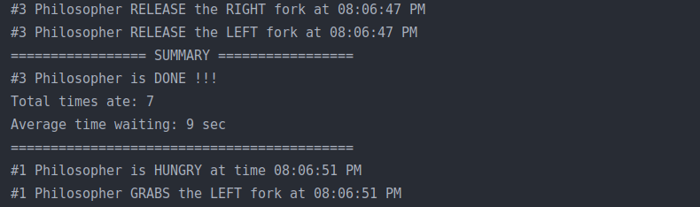
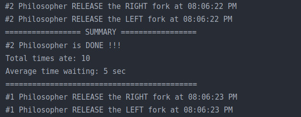
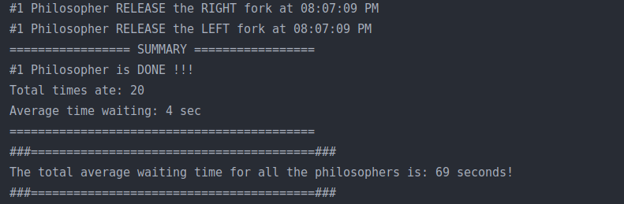

# The dining philosophers problem in Java

This Java application solves the philosophers' dinner problem as follows:
1. Every philosopher will be implemented as a process or a thread.
2. It will initially show the user the ability to define the number of philosophers (from N = 3 to 10). Then the corresponding number of philosophers (threads or processes) will be created.
3. Each philosopher will remain for a random number of seconds in THINKING mode (ie blocked).
4. Each philosopher will have one priority in his execution as follows:
Suppose the time quantum is Q = 1sec. The n-th philosopher will be given execution time equal to T (n) = nQ 
(eg philosopher 1, time 1Q is given, philosopher 8 is given time 8 * Q). 
5. The duration of the HUNGRY (ready) state depends on the execution path of the program and will not be determined by the programmer. 
6. Each philosopher will display messages on the screen to indicate the status of the system at that time. When the philosopher changes 
state, he will again display the corresponding message (one message for each state change).
7. When a philosopher tries to get both forks, he can succeed or fail. Display messages indicating the success or failure 
of getting the two forks. In case of failure a message will be displayed. (eg Philosopher 2 failed to take fork 1, because Philosopher 1 was eating). 
8. For each philosopher Calculate his average waiting time (how long it took the philosopher to get the two forks and go into EATING mode). 
9. Every philosopher should be in EATING mode for a total of 20 seconds. Once the 20 sec have passed, he will declare that he 
has finished his dinner, and will remain in THINKING mode until all philosophers finish their dinner. 
10. The program ends when all philosophers have finished their dinner (each philosopher ate for 20 sec).

  
Initialize program with 3 philosophers.

  
Philosopher 3 is done.

  
Philosopher 2 is done.

  
Philosopher 1 is done. Average waiting time displayed.
